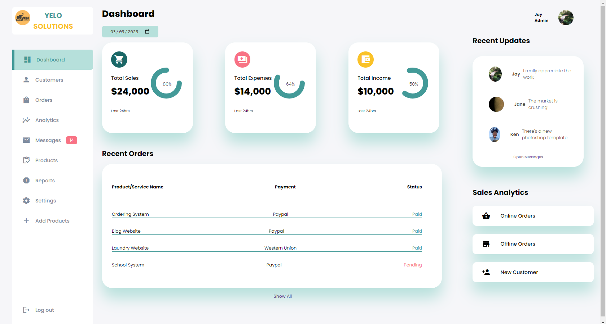

# Admin Dashboard
This repository contains an admin dashboard implemented with Python's Flask, JavaScript, HTML, and CSS. The dashboard provides a user interface for administrators to manage their system resources, including users, products, orders, and other related information.

## Getting Started
To get started with this project, clone the repository to your local machine:

``` git clone https://github.com/yelosolutions/admin-dashboard.git ```
Next, navigate to the project directory and install the dependencies:

``` python -m venv .venv ```
``` .venv\Scripts\activate.bat #windows cmd ```
``` pip install -r requirements.txt ```

After installing the dependencies, you can start the application by running:

```flask run```

The application should now be running on http://localhost:5000/.

## Features
This admin dashboard comes with several features to help you manage your system resources:

User Management: Add, edit, and delete users in the system.
Product Management: Add, edit, and delete products in the system.
Order Management: View, edit, and delete orders in the system.
Analytics: View various metrics and statistics related to your system.

## Technology Stack
Flask: A micro web framework for Python.
JavaScript: A scripting language for web development.
HTML: A markup language for creating web pages.
CSS: A style sheet language for describing the presentation of web pages.

## Screenshots


## Contributing
Contributions to this project are always welcome. If you find any issues or would like to suggest a new feature, please create a new issue or pull request.

## License
This project is licensed under the MIT License. See the LICENSE file for more information.